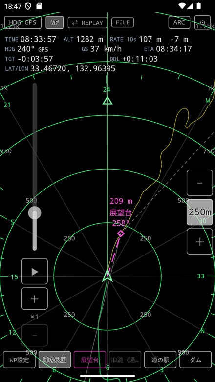
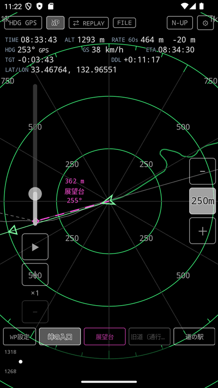
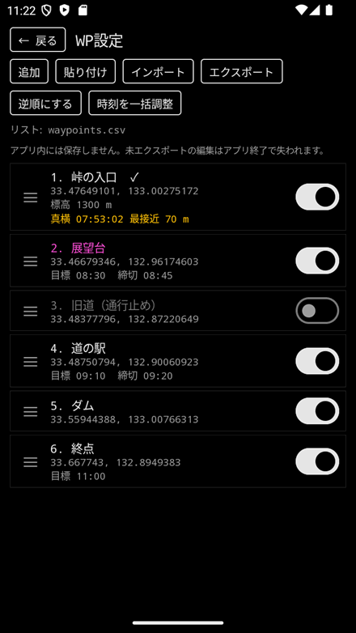
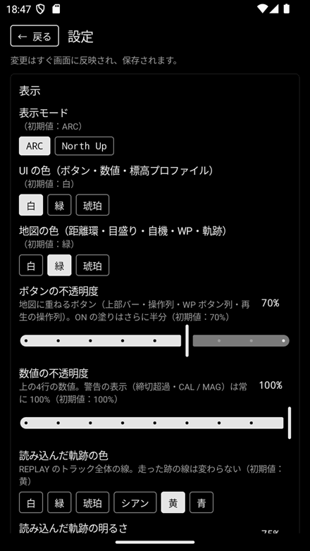

# NavHUD（移動目標案内アプリ）

航空機の ND（ナビゲーション表示）風の画面で、WP（目標地点）までの方位・距離・時刻を案内する Android アプリです。地図は使わず、自機・距離環・WP の位置関係を黒い画面に線で描きます。

  
  
  
  

※スクリーンショットは、記録したサンプルデータを再生（REPLAY）した画面です。左から 普段の画面（ARC）/ North Up / WP の一覧 / 設定。

## 特徴

- **ARC / North Up の表示** — 進行方向を上にする表示と、北を上にする表示を切り替え
- **次の WP への案内** — 距離・名前・方位を画面に表示。画面の外にある WP は、その方向の端に表示
- **WP の到達の自動判定** — 到達半径・横を通過・通過（予備）の3つで判定し、自動で次の WP へ進む
- **AUTO の縮尺** — 次の WP が画面に入る縮尺を自動で選び、近づくと詳細に切り替え
- **目標時刻・締切時刻との差** — WP ごとの目標時刻（TGT）・締切時刻（DDL）までの時間と、到着予想（ETA）を表示
- **記録の再生（REPLAY）** — GPS の記録（track.csv）を、速度を変えて再生
- **地図 API を使わない** — 通信をしないので、携帯の電波が届かない所でも使えます
- **日本語・英語対応**

## 動作環境

- Android 8.0（API 26）以降
- GPS が使える端末（コンパスのある端末では、方位にコンパスも使えます）

## 画面構成

- **上部のボタン** — 方位の取り方（HDG）、WP ボタン列の表示、LIVE / REPLAY の切り替え、ARC / North Up、設定
- **数値の行** — 時刻、標高、移動距離と高度差、方位、速度、ETA、TGT / DDL、緯度・経度
- **地図の部分** — 自機、距離環、WP の印と線、次の WP の文字、走った跡。ドラッグで先を見る（パン）、ピンチで縮尺を詳細・広域に切り替え
- **右の縮尺のボタン** — ＋ / − と、AUTO の切り替え
- **下の WP ボタン列** — タップで到達済みの切り替え、長押しでその WP へパン。その下に標高プロファイル

詳しい使い方は [チートシート（PDF）](docs/cheatsheet.pdf) にまとめています（A4 1枚）。

## ファイル形式

- **WP リスト（CSV）** — 読み込みと書き出し。1行目は見出しで、必須は `lat` と `lon` です。名前・標高・目標時刻・締切時刻なども書けます。Excel で編集できます。
- **WP リスト（GPX）** — 読み込みのみ。`<wpt>` の位置と名前などを読みます。
- **再生用の記録（track.csv）** — 読み込みのみ。見出しに `latitude`・`longitude` と、時刻（`epoch_ms` か `utc_iso8601`）が必要です。[GpsLogger](https://github.com/eightbrows/GpsLogger) が記録する track.csv の形式です。
- **GpsLogger の zip** — GpsLogger で書き出した zip をそのまま読めます。中のセッションの一覧から1つ選んで再生します。

ご注意：WP リストはアプリの中に保存しません。編集したら CSV に書き出してください。

## 設定

- **表示** — ARC / North Up、UI と地図の色（白 / 緑 / 琥珀）、ボタンと数値の不透明度
- **方位** — 方位の取り方（GPS / HYBRID / COMPASS）
- **縮尺** — 使う縮尺の段、AUTO の詳細の限度と広域の限度
- **WP** — 移動手段ごとの到達の判定の値（自動車 / カスタム1〜3）
- **その他** — 標高オフセット、画面常時点灯 など

## 権限

| 権限 | 用途 |
|---|---|
| 位置情報（正確な位置・おおよその位置） | GPS で現在地を測る。許可しなくても、記録の再生（REPLAY）は使えます |
| フォアグラウンドサービス（位置情報） | 画面を表示している間、位置の取得を続ける。バックグラウンドの位置情報は使いません |
| 通知（Android 13 以降） | 動作中であることを通知に出す。許可しなくても動きます |

インターネットの権限は持っていないので、位置や WP などのデータをアプリが端末の外に送ることはありません。ファイルの読み書きは、Android のファイル選択の画面で選んだファイルだけです。

なお、端末のバックアップ（Android の機能）を ON にしている場合、アプリの設定はそのバックアップに含まれます。

## インストール

[Releases](../../releases) から APK をダウンロードしてインストールしてください。

## ライセンス

Apache License 2.0 の下で公開しています。詳細は [LICENSE](LICENSE) を参照してください。
